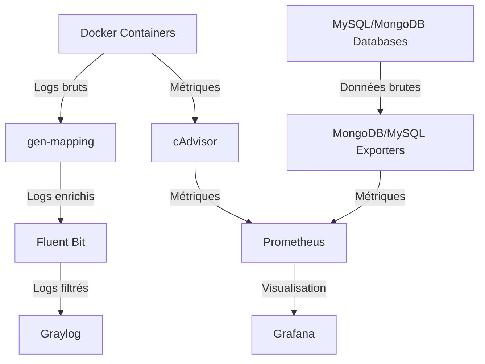

# Monitoring Infrastructure Documentation

## 🔧 Stack de supervision utilisée

Cette infrastructure de supervision repose sur les outils suivants :

- **Graylog** : Centralisation des logs Docker avec un input GELF UDP configuré automatiquement au lancement.
- **Fluent Bit** : Collecte des logs enrichis à partir des fichiers générés par le service `gen-mapping`.
- **gen-mapping** : Service Node.js personnalisé qui :
    - Génère un fichier `container-map.json` contenant les métadonnées des conteneurs Docker actifs (`container_id`, `container_name`, `ip_address`, `host_port`).
    - Enrichit en temps réel les logs Docker dans `/shared-logs` via `enrich-logs.js`.
- **Prometheus** : Collecte des métriques système et applicatives.
- **cAdvisor** : Exportation des métriques des conteneurs Docker vers Prometheus.
- **Grafana** : Visualisation des métriques Prometheus via des dashboards.
- **MongoDB Exporter** et **MySQL Exporter** : Exportation des métriques des bases de données respectives.

---

## 📁 Structure et automatisation

### Déclaration des services
Tous les services sont déclarés dans le fichier `docker-compose.yml` pour une orchestration simplifiée.

### Automatisation des configurations
- **gen-mapping** :
    - Configure automatiquement l’input GELF dans Graylog via l’API admin (authentification HTTP Basic).
    - Génère dynamiquement le fichier `container-map.json` et enrichit les logs Docker.
- **Fluent Bit** :
    - Lit les logs enrichis exposés via un volume partagé.
    - Filtre les logs pour éviter d’envoyer ceux de `graylog`, `fluentbit` et `gen-mapping` à Graylog.

---

## 🧪 Fonctionnement détaillé

### Étapes au lancement de `docker compose`
1. **Génération des métadonnées** :
     - Le script `script-gen-mapping.js` récupère les métadonnées des conteneurs Docker et crée `container-map.json`.
2. **Configuration de Graylog** :
     - Le script `setup-gelf.js` configure l’entrée GELF dans Graylog si elle n’existe pas.
3. **Enrichissement des logs** :
     - Le script `enrich-logs.js` lit les logs existants et nouveaux en temps réel, puis les enrichit.
4. **Collecte et envoi des logs** :
     - Fluent Bit collecte les logs enrichis, applique des filtres, restructure les données et les envoie à Graylog.

---

## 📊 Dashboards Prometheus / Grafana

Les dashboards Grafana permettent de visualiser les métriques collectées par Prometheus. Voici les principales données surveillées :
- **Performances des conteneurs Docker** :
    - Utilisation CPU, RAM et disque.
- **Métriques des bases de données** :
    - MongoDB et MySQL via leurs exporters respectifs.

---

## ⚙️ Configuration par défaut Grafana

Lors du lancement des services, Grafana est configuré avec :
- **Source de données par défaut** : Prometheus est automatiquement ajouté comme source de données principale.
- **Dashboard par défaut** : Un dashboard préconfiguré est importé automatiquement pour visualiser les métriques principales.

---

## 🛡️ Sécurité & fiabilité

- **Redémarrage automatique** : Les services critiques sont configurés avec `restart: always`.
- **Gestion des secrets** : Les informations sensibles sont stockées dans un fichier `.env`.
- **Surveillance centralisée** : Les logs historiques sont enrichis par conteneur pour une meilleure traçabilité.

---

## 📂 Chemins et configurations importantes

- **Fichier de logs enrichis** : `/shared-logs`
- **Fichier des métadonnées des conteneurs** : `container-map.json`
- **Configuration Fluent Bit** : `fluent-bit.conf`
- **Entrée GELF Graylog** : Configurée via l’API admin.

---

## 🐳 Commandes Docker utiles

### Lancer les services
```bash
docker compose up -d
```

### Accéder à Graylog
- URL : `http://localhost:9000`
- Identifiants par défaut : `admin / admin`

### Ports exposés
- Graylog : `9000`
- Prometheus : `9090`
- Grafana : `3000`
- cAdvisor : `8080`


---

## 📜 Schéma de fonctionnement mis à jour



---

## 📝 Remarques supplémentaires

- Assurez-vous que le fichier `.env` est correctement configuré avant de lancer les services.
- Les dashboards Grafana peuvent être importés via des fichiers JSON préconfigurés disponibles dans le dossier `grafana/dashboards`.

---  